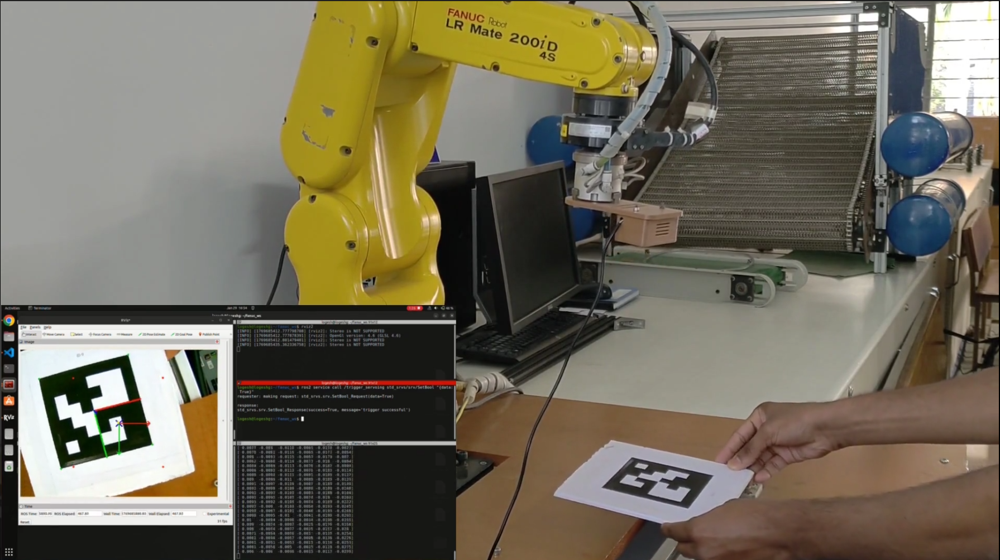

Hi! I’m a final-year Computer Science and Business Systems student at Bannari Amman Institute of Technology with a strong passion for robotics and computer vision. My work focuses on developing innovative solutions that blend perception, vision, and robotics. I am currently working on robot manipulators.

**Education**   
 **Bannari Amman Institute of Technology**, Tamil Nadu, India  
 *2022 - 2026*
 - **Degree :** Bachelor of Technology in Computer Science and Business Systems  
 - **CGPA :** 8.5

---

## Experience
**1. MOWITO:** (Internship) 
- Robotics Software Intern
- May 2025 - December 2025

---

## Skills
- **Programming Languages:** Python, C, C++, MATLAB
- **Robotics / Computer vision:** ROS2 Drivers, Object Detectors, Pose Estimation
- **Frameworks / Libraries:** ROS2, OpenCV, PyTorch(basics)
- **Tools:** Git, Linux, Docker, Arduino IDE

---

## Area of Interests
- Robotic Manipulation
- Computer Vision (Robot Perception)

---

## Current Projects

### Robot Manipulation (Using Visual Servoing)

I am currently working on robot manipulators (Fanuc LR Mate 200id 4s to be specific) to perform useful tasks like assembly and house hold tasks using visual servoing. Working on Fanuc ROS2 drivers (Ethernet/IP based) to be compatible with both position and velocity controller. <a href="https://github.com/logeshg2/fanuc_ros2_drivers" target="_blank">ROS2 Driver Repo</a> .

