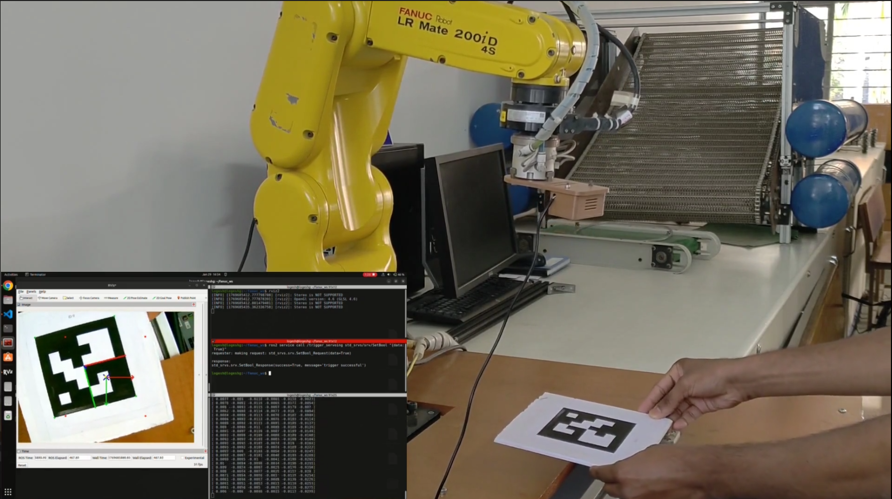
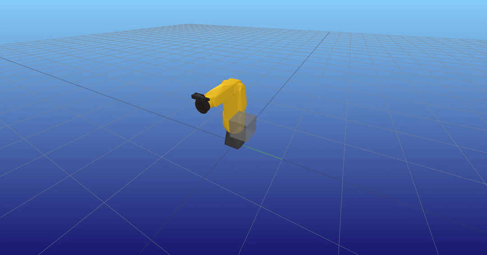

Hi! I’m Logesh. I have a strong passion for robotics, particularly on robot manipulators.

---

#### Education
 **Bannari Amman Institute of Technology**, Tamil Nadu, India  
 *2022 - 2026*
 - Degree : Bachelor of Technology in Computer Science and Business Systems  

---

#### Experience
**1. MOWITO** - **Robotics Software Intern**   
*May 2025 to December 2025* 
- Contributed​ ​to​ ​a​ ​high-precision​ ​robotics​ ​product​ ​by​ ​assisting​ ​in​ ​the​ ​development ​​and​ stabilization of a ROS 2-based software system.​

---

#### Skills
- **Programming Languages:** Python, C, C++, MATLAB
- **Robotics:** ​​Robot Modeling, Kinematics, Motion Planning, Visual Servoing, ROS2 Driver Development​ 
- **Computer vision:** ​Object Detectors, Object Pose Estimation,​​Classical Computer Vision​
- **Frameworks / Libraries:** ROS2, OpenCV, NumPy, Py-Trees, PyTorch(basics)
- **Tools:** Git, Linux, Docker, Arduino IDE

---

## Projects

### Visual Servoing - Precise Assembly

I developed a visual servoing package for a FANUC LR Mate 200iD/4S industrial manipulator integrating perception and control for object-centric manipulation and servoing. Designed a hybrid IBVS-PBVS visual servoing controller and implemented the task-level architecture using Py-Trees Behavior Trees for modular manipulation workflows.

<!--  -->





Fanuc LR Mate ROS2 Driver: <a href="https://github.com/logeshg2/fanuc_ros2_drivers" target="_blank">ROS2 Driver Repo</a>
  
Visual Servoing Pkg: <a href="https://github.com/logeshg2/visual-servoing-pkg" target="_blank">Visua Servoing Pkg</a>

---

### Motion Planning Package (MPKG)

I developed a sampling-based motion planning package for robotic manipulators, implementing RRT and RRT* algorithms from scratch for high-dimensional robot configuration space. Integrated collision checking, nearest-neighbour search, and shortcut-based path smoothing to generate collision-free path, with visualization.

Motion Planning Pkg: <a href="https://github.com/logeshg2/motion_planning_pkg" target="_blank">MPKG Github</a>

---

### SCARA Robotic Arm

I developed an autonomous SCARA robot capable of picking parcel packages from a tote and placing them on a conveyor in a warehouse environment. The entire operation is hardcoded in Python, and the robot uses the YOLOv8 object detection algorithm to accurately detect parcels.

This project provided me with hands-on experience in applying inverse kinematics for a 2DOF robotic arm and integrating various hardware components, such as cameras and robotic arms, with software to perform specific tasks effectively.

<!--  -->



For more information check: <a href="https://github.com/logeshg2/Autonomous_pick_and_place_robot" target="_blank">Project Repo</a>

---

### BCN-3D Moveo Robotic Arm

My team and I built the open source BCN-3D Moveo robotic arm. Where I contributed by developing the software part in this project. I developed the Moveo model in Robotics Toolbox which enabled IK, FK, and trajectory planning algorithms. I have used ROS1 framework the communication between the different sub-systems.

<!--  -->



For more information check: <a href="https://github.com/logeshg2/Moveo_5-DOF_Software"> Project Repo </a>

---

### Robotic Manipulators (Fanuc Robotic Arm)

I worked on developing the robot model and high level software control for Fanuc Robotic arm (LR Mate 200iD 4s model). Documentation and demo can be seen here: <a href="https://github.com/logeshg2/LR_Mate_200iD_4S-Robot-Model/" target="_blank">Project Repo</a> .

<!--  -->

